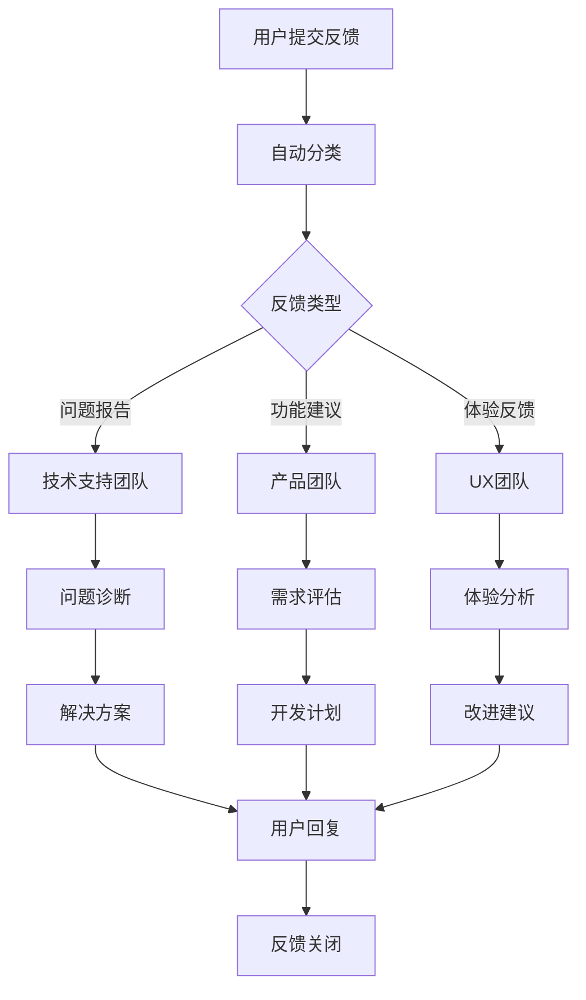

# CJPayment管理后台帮助支持系统

## 概述

本文档描述了CJPayment管理后台的完整帮助支持系统，包括多层次的用户支持渠道、自助服务工具和技术支持流程。

## 支持体系架构

### 1. 自助服务层

#### 在线帮助中心
- **位置**：系统右下角帮助按钮
- **内容**：
  - 快速入门指南
  - 功能使用教程
  - 常见问题解答
  - 视频教程库
  - 操作手册下载

#### 智能帮助助手
- **功能**：基于AI的智能问答
- **特点**：
  - 自然语言查询
  - 上下文相关建议
  - 操作步骤指导
  - 实时问题解答

#### 交互式教程
- **类型**：
  - 新用户引导
  - 功能演示
  - 操作练习
  - 技能评估

### 2. 社区支持层

#### 用户社区论坛
- **功能**：
  - 用户经验分享
  - 问题讨论
  - 最佳实践交流
  - 功能建议投票

#### 知识库
- **内容**：
  - 用户贡献的解决方案
  - 专家答疑
  - 案例研究
  - 技巧分享

### 3. 专业支持层

#### 在线客服
- **服务时间**：工作日 9:00-18:00
- **响应时间**：5分钟内
- **支持方式**：
  - 实时聊天
  - 屏幕共享
  - 远程协助

#### 技术支持热线
- **服务时间**：7×24小时
- **电话**：400-XXX-XXXX
- **支持级别**：
  - L1：基础问题解答
  - L2：技术问题诊断
  - L3：复杂问题解决

#### 邮件支持
- **邮箱**：support@cjpayment.com
- **响应时间**：
  - 紧急问题：2小时内
  - 一般问题：24小时内
  - 功能建议：72小时内

## 支持工具和功能

### 1. 智能帮助系统

#### 上下文感知帮助
```javascript
// 根据用户当前页面提供相关帮助
function getContextualHelp() {
    const currentPage = window.location.pathname;
    const helpContent = {
        '/dashboard': {
            title: '仪表板使用指南',
            topics: ['统计卡片说明', '图表交互', '快捷操作'],
            quickActions: ['查看详细数据', '导出报表', '设置提醒']
        },
        '/recharge': {
            title: '充值管理帮助',
            topics: ['创建订单', '批量操作', '状态管理'],
            quickActions: ['新建订单', '批量导入', '状态筛选']
        }
        // ... 更多页面
    };
    
    return helpContent[currentPage] || helpContent.default;
}
```

#### 智能搜索
- **功能特点**：
  - 模糊匹配
  - 同义词识别
  - 历史搜索记录
  - 搜索结果排序

#### 操作录制回放
- **功能**：记录用户操作步骤
- **用途**：
  - 问题重现
  - 操作教学
  - 错误诊断
  - 流程优化

### 2. 问题诊断工具

#### 自动问题检测
```javascript
class ProblemDetector {
    constructor() {
        this.checks = [
            this.checkBrowserCompatibility,
            this.checkNetworkConnection,
            this.checkLocalStorage,
            this.checkJavaScriptErrors,
            this.checkPerformanceIssues
        ];
    }
    
    async runDiagnostics() {
        const results = [];
        for (const check of this.checks) {
            try {
                const result = await check.call(this);
                results.push(result);
            } catch (error) {
                results.push({
                    check: check.name,
                    status: 'error',
                    message: error.message
                });
            }
        }
        return results;
    }
    
    checkBrowserCompatibility() {
        const userAgent = navigator.userAgent;
        const supportedBrowsers = {
            chrome: 80,
            firefox: 75,
            safari: 13,
            edge: 80
        };
        
        // 检测浏览器版本
        // 返回兼容性结果
    }
    
    checkNetworkConnection() {
        return new Promise((resolve) => {
            const start = Date.now();
            fetch('/api/ping')
                .then(() => {
                    const latency = Date.now() - start;
                    resolve({
                        check: 'network',
                        status: latency < 1000 ? 'good' : 'slow',
                        latency: latency
                    });
                })
                .catch(() => {
                    resolve({
                        check: 'network',
                        status: 'error',
                        message: '网络连接异常'
                    });
                });
        });
    }
}
```

#### 系统信息收集
- **收集内容**：
  - 浏览器信息
  - 操作系统
  - 屏幕分辨率
  - 网络状态
  - 错误日志

### 3. 用户反馈系统

#### 多渠道反馈收集
- **反馈类型**：
  - 问题报告
  - 功能建议
  - 用户体验反馈
  - 满意度调查

#### 反馈处理流程


## 帮助内容管理

### 1. 内容结构

#### 分层帮助体系
```
帮助中心
├── 快速入门
│   ├── 系统概览
│   ├── 首次登录
│   ├── 基本操作
│   └── 常用功能
├── 功能指南
│   ├── 仪表板
│   ├── 充值管理
│   ├── 用户管理
│   ├── 系统配置
│   └── 报表分析
├── 高级功能
│   ├── 批量操作
│   ├── 数据导入导出
│   ├── API集成
│   └── 自定义配置
├── 故障排除
│   ├── 常见问题
│   ├── 错误代码
│   ├── 性能问题
│   └── 兼容性问题
└── 视频教程
    ├── 基础操作
    ├── 高级功能
    ├── 最佳实践
    └── 案例演示
```

#### 内容标准化
- **文档模板**：统一的帮助文档格式
- **截图规范**：标准化的界面截图
- **视频标准**：统一的视频制作规范
- **更新机制**：定期内容更新和维护

### 2. 多媒体支持

#### 视频教程系统
- **制作标准**：
  - 分辨率：1920x1080
  - 时长：5-15分钟
  - 字幕：中英文双语
  - 格式：MP4 H.264

#### 交互式演示
- **技术实现**：HTML5 + JavaScript
- **功能特点**：
  - 步骤引导
  - 实时操作
  - 进度跟踪
  - 错误纠正

#### 图文教程
- **内容要求**：
  - 步骤清晰
  - 截图准确
  - 说明详细
  - 定期更新

## 支持质量保证

### 1. 服务水平协议(SLA)

#### 响应时间标准
| 问题级别 | 响应时间 | 解决时间 | 可用性 |
|---------|---------|---------|--------|
| 紧急 | 15分钟 | 2小时 | 99.9% |
| 高 | 1小时 | 8小时 | 99.5% |
| 中 | 4小时 | 24小时 | 99.0% |
| 低 | 24小时 | 72小时 | 98.0% |

#### 质量指标
- **首次解决率**：≥80%
- **客户满意度**：≥4.5/5.0
- **平均解决时间**：≤24小时
- **知识库命中率**：≥70%

### 2. 持续改进机制

#### 反馈分析
- **数据收集**：
  - 用户反馈统计
  - 问题类型分析
  - 解决时间跟踪
  - 满意度调查

#### 改进措施
- **内容优化**：根据常见问题更新帮助内容
- **流程改进**：优化支持流程和响应机制
- **工具升级**：改进支持工具和系统
- **培训加强**：提升支持团队技能

## 技术实现

### 1. 帮助系统架构

#### 前端组件
```javascript
// 帮助系统主组件
class HelpSystem {
    constructor() {
        this.helpData = {};
        this.searchIndex = {};
        this.userContext = {};
        this.init();
    }
    
    init() {
        this.loadHelpData();
        this.buildSearchIndex();
        this.setupEventListeners();
        this.initContextualHelp();
    }
    
    showHelp(topic = null) {
        if (topic) {
            this.displayTopic(topic);
        } else {
            this.showHelpCenter();
        }
    }
    
    search(query) {
        const results = this.searchInIndex(query);
        return this.rankResults(results);
    }
    
    getContextualHelp() {
        const context = this.getCurrentContext();
        return this.helpData.contextual[context] || this.helpData.general;
    }
}
```

#### 后端API
```javascript
// 帮助内容API
app.get('/api/help/search', (req, res) => {
    const { query, context } = req.query;
    const results = helpSearchEngine.search(query, context);
    res.json(results);
});

app.get('/api/help/topic/:id', (req, res) => {
    const topic = helpContentManager.getTopic(req.params.id);
    res.json(topic);
});

app.post('/api/help/feedback', (req, res) => {
    const feedback = req.body;
    helpFeedbackManager.submit(feedback);
    res.json({ success: true });
});
```

### 2. 智能推荐系统

#### 内容推荐算法
```javascript
class HelpRecommendationEngine {
    constructor() {
        this.userBehavior = new Map();
        this.contentSimilarity = new Map();
        this.contextRules = new Map();
    }
    
    recommend(userId, context) {
        const userHistory = this.userBehavior.get(userId) || [];
        const contextualContent = this.getContextualContent(context);
        const similarContent = this.findSimilarContent(userHistory);
        
        return this.rankRecommendations([
            ...contextualContent,
            ...similarContent
        ]);
    }
    
    trackUserBehavior(userId, action, content) {
        const behavior = this.userBehavior.get(userId) || [];
        behavior.push({
            action,
            content,
            timestamp: Date.now()
        });
        this.userBehavior.set(userId, behavior);
    }
}
```

### 3. 分析和监控

#### 使用统计
- **页面访问量**：各帮助页面的访问统计
- **搜索热词**：用户搜索关键词分析
- **用户路径**：帮助系统使用路径分析
- **转化率**：帮助内容到问题解决的转化率

#### 性能监控
- **加载时间**：帮助内容加载性能
- **搜索响应**：搜索功能响应时间
- **错误率**：系统错误和异常监控
- **可用性**：服务可用性监控

## 移动端支持

### 1. 响应式设计

#### 移动端优化
- **界面适配**：针对小屏幕优化的帮助界面
- **触摸交互**：适合触摸操作的交互设计
- **离线支持**：关键帮助内容的离线缓存
- **快速加载**：优化的移动端加载性能

#### 原生应用集成
- **SDK提供**：帮助系统SDK供移动应用集成
- **深度链接**：支持从应用直接跳转到特定帮助内容
- **推送通知**：重要帮助信息的推送通知
- **语音助手**：语音查询和语音播放帮助内容

### 2. 多语言支持

#### 国际化功能
- **多语言内容**：中文、英文等多语言帮助内容
- **自动检测**：根据用户语言偏好自动切换
- **翻译质量**：专业翻译和本地化
- **文化适配**：考虑不同文化背景的内容适配

## 安全和隐私

### 1. 数据保护

#### 用户隐私
- **数据最小化**：只收集必要的用户数据
- **匿名化处理**：敏感数据的匿名化处理
- **数据加密**：传输和存储数据的加密保护
- **访问控制**：严格的数据访问权限控制

#### 合规要求
- **GDPR合规**：符合欧盟数据保护法规
- **本地法规**：遵守当地数据保护法律
- **审计跟踪**：完整的数据访问和操作日志
- **用户权利**：支持用户数据查看、修改、删除权利

### 2. 系统安全

#### 安全措施
- **身份验证**：用户身份验证和授权
- **会话管理**：安全的会话管理机制
- **输入验证**：严格的用户输入验证
- **XSS防护**：跨站脚本攻击防护

## 成本和资源

### 1. 人力资源

#### 团队配置
- **支持工程师**：3-5人，负责技术支持
- **内容编辑**：2-3人，负责帮助内容维护
- **产品经理**：1人，负责支持体系规划
- **QA工程师**：1-2人，负责质量保证

#### 技能要求
- **技术技能**：系统知识、问题诊断能力
- **沟通技能**：良好的用户沟通能力
- **文档技能**：技术文档编写能力
- **多语言**：多语言支持能力（可选）

### 2. 技术成本

#### 基础设施
- **服务器成本**：帮助系统服务器和CDN
- **存储成本**：帮助内容和用户数据存储
- **带宽成本**：视频和多媒体内容传输
- **第三方服务**：客服系统、分析工具等

#### 开发维护
- **初期开发**：系统开发和集成成本
- **持续维护**：系统维护和更新成本
- **内容制作**：帮助内容制作和更新成本
- **工具采购**：支持工具和软件许可成本

---

*本帮助支持系统将为CJPayment管理后台用户提供全方位、多层次的支持服务，确保用户能够高效使用系统并及时解决遇到的问题。*