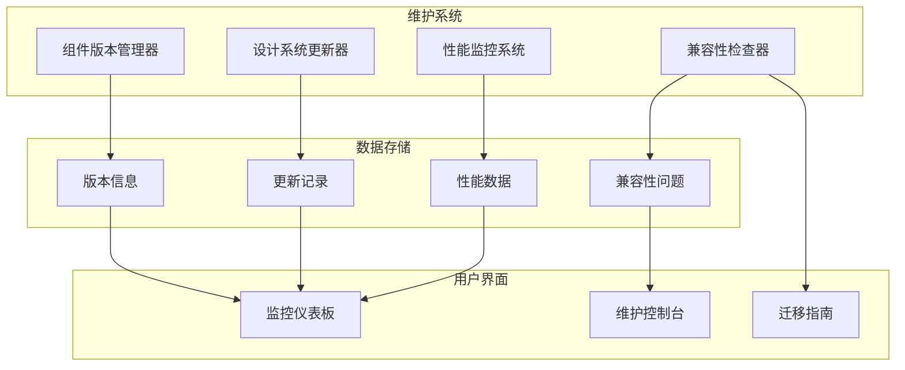

# 前端维护和更新系统文档

## 概述

前端维护和更新系统是一个完整的解决方案，用于管理组件库的版本控制、设计系统的持续改进和向后兼容性保证。该系统确保前端代码库能够平滑地进行版本升级，同时保持向后兼容性。

## 系统架构



## 核心组件

### 1. 组件版本管理器 (ComponentVersionManager)

负责管理组件库的版本控制和迁移。

#### 主要功能

- **版本跟踪**: 跟踪每个组件的版本信息
- **迁移管理**: 自动执行版本间的迁移
- **依赖管理**: 管理组件间的依赖关系
- **弃用管理**: 处理组件的弃用和移除

#### 使用示例

```javascript
// 注册组件
componentVersionManager.registerComponent('Button', '1.0.0', {
    dependencies: [],
    breakingChanges: [],
    deprecatedProps: []
});

// 检查兼容性
const isCompatible = componentVersionManager.validateCompatibility('Button', '1.0.0');

// 执行迁移
componentVersionManager.performMigration('0.9.0', '1.0.0');
```

#### API 参考

| 方法 | 描述 | 参数 | 返回值 |
|------|------|------|--------|
| `registerComponent(name, version, metadata)` | 注册组件 | name: string, version: string, metadata: object | void |
| `validateCompatibility(name, version)` | 验证兼容性 | name: string, version: string | boolean |
| `performMigration(from, to)` | 执行迁移 | from: string, to: string | void |
| `getAllComponents()` | 获取所有组件 | - | Array |
| `generateCompatibilityReport()` | 生成兼容性报告 | - | object |

### 2. 设计系统更新器 (DesignSystemUpdater)

管理设计系统的持续改进和优化。

#### 主要功能

- **自动更新**: 自动检查和应用设计系统更新
- **更新通知**: 通知用户可用的更新
- **回滚支持**: 支持更新的回滚操作
- **更新历史**: 记录所有更新的历史

#### 更新类型

1. **设计令牌更新**: 颜色、字体、间距等设计令牌的更新
2. **组件样式优化**: 组件样式的性能和可访问性优化
3. **响应式布局改进**: 布局系统的改进
4. **可访问性增强**: 可访问性功能的增强
5. **性能优化**: 性能相关的优化

#### 使用示例

```javascript
// 检查更新
const updates = designSystemUpdater.getAvailableUpdates();

// 应用更新
designSystemUpdater.applyUpdates(updates);

// 回滚更新
designSystemUpdater.rollbackUpdate('design-tokens-v1.1');

// 获取更新历史
const history = designSystemUpdater.getUpdateHistory();
```

#### API 参考

| 方法 | 描述 | 参数 | 返回值 |
|------|------|------|--------|
| `getAvailableUpdates()` | 获取可用更新 | - | Array |
| `applyUpdates(updates)` | 应用更新 | updates: Array | void |
| `rollbackUpdate(id)` | 回滚更新 | id: string | void |
| `getUpdateHistory()` | 获取更新历史 | - | Array |
| `generateUpdateReport()` | 生成更新报告 | - | object |

### 3. 兼容性检查器 (CompatibilityChecker)

确保向后兼容性和平滑的版本升级。

#### 主要功能

- **兼容性检查**: 检查代码中的兼容性问题
- **自动修复**: 自动修复可修复的兼容性问题
- **弃用警告**: 显示弃用功能的警告
- **迁移指南**: 生成详细的迁移指南

#### 检查类型

1. **CSS类名兼容性**: 检查已弃用的CSS类名
2. **HTML属性兼容性**: 检查已弃用的HTML属性
3. **JavaScript API兼容性**: 检查已弃用的JavaScript API
4. **破坏性变更检测**: 检测破坏性变更

#### 使用示例

```javascript
// 运行兼容性检查
const issues = compatibilityChecker.runCompatibilityCheck();

// 自动修复问题
compatibilityChecker.autoFixIssues(issues.filter(i => i.autoFixable));

// 生成迁移指南
const guide = compatibilityChecker.generateMigrationGuide();

// 导出迁移指南
compatibilityChecker.exportMigrationGuide();
```

#### API 参考

| 方法 | 描述 | 参数 | 返回值 |
|------|------|------|--------|
| `runCompatibilityCheck()` | 运行兼容性检查 | - | Array |
| `autoFixIssues(issues)` | 自动修复问题 | issues: Array | void |
| `generateMigrationGuide()` | 生成迁移指南 | - | object |
| `getCompatibilityReport()` | 获取兼容性报告 | - | object |

### 4. 性能监控系统

监控前端性能和用户体验指标。

#### 监控指标

1. **Web Vitals**: LCP, FID, CLS等核心性能指标
2. **资源加载**: CSS、JavaScript、图片等资源的加载时间
3. **用户行为**: 点击、滚动、表单交互等用户行为
4. **错误监控**: JavaScript错误、网络错误等

#### 使用示例

```javascript
// 记录自定义性能指标
performanceMonitor.recordMetric('CustomMetric', 100);

// 获取性能摘要
const summary = performanceMonitor.getMetricsSummary();

// 跟踪用户行为
userBehaviorMonitor.track('button_click', { buttonId: 'submit' });
```

## 配置选项

### 组件版本管理器配置

```javascript
const config = {
    enableVersionCheck: true,        // 启用版本检查
    enableAutoMigration: true,       // 启用自动迁移
    enableDeprecationWarnings: true, // 启用弃用警告
    storageKey: 'component_versions' // 存储键名
};
```

### 设计系统更新器配置

```javascript
const config = {
    enableAutoUpdate: true,           // 启用自动更新
    enableUpdateNotifications: true, // 启用更新通知
    updateCheckInterval: 86400000,   // 更新检查间隔（毫秒）
    storageKey: 'design_system_updates'
};
```

### 兼容性检查器配置

```javascript
const config = {
    enableWarnings: true,                    // 启用警告
    enableBreakingChangeDetection: true,    // 启用破坏性变更检测
    enableAutoFix: true,                     // 启用自动修复
    storageKey: 'compatibility_issues'
};
```

### 性能监控配置

```javascript
const config = {
    enableWebVitals: true,        // 启用Web Vitals监控
    enableResourceTiming: true,   // 启用资源时间监控
    enableUserTiming: true,       // 启用用户时间监控
    reportInterval: 30000,        // 上报间隔（毫秒）
    maxMetrics: 1000             // 最大指标数量
};
```

## 最佳实践

### 1. 版本管理

- **语义化版本**: 使用语义化版本号（major.minor.patch）
- **渐进式更新**: 采用渐进式更新策略，避免大幅度变更
- **向后兼容**: 尽可能保持向后兼容性
- **文档更新**: 及时更新文档和迁移指南

### 2. 更新策略

- **测试优先**: 在应用更新前进行充分测试
- **分阶段发布**: 采用分阶段发布策略
- **监控反馈**: 密切监控更新后的性能和错误
- **快速回滚**: 准备快速回滚机制

### 3. 兼容性保证

- **定期检查**: 定期运行兼容性检查
- **自动化测试**: 建立自动化兼容性测试
- **用户通知**: 及时通知用户破坏性变更
- **迁移支持**: 提供完整的迁移支持

### 4. 性能监控

- **关键指标**: 重点监控关键性能指标
- **用户体验**: 关注用户体验相关指标
- **错误处理**: 建立完善的错误处理机制
- **数据分析**: 定期分析监控数据

## 故障排除

### 常见问题

#### 1. 迁移失败

**问题**: 组件迁移过程中出现错误

**解决方案**:
- 检查迁移规则是否正确
- 确认目标元素是否存在
- 查看控制台错误信息
- 手动执行迁移步骤

#### 2. 兼容性检查误报

**问题**: 兼容性检查报告了不存在的问题

**解决方案**:
- 更新兼容性规则
- 检查选择器是否正确
- 排除第三方代码
- 调整检查配置

#### 3. 性能监控数据异常

**问题**: 性能监控数据显示异常值

**解决方案**:
- 检查监控配置
- 验证数据收集逻辑
- 排除网络问题
- 重置监控数据

#### 4. 更新应用失败

**问题**: 设计系统更新无法正确应用

**解决方案**:
- 检查更新权限
- 确认DOM结构
- 查看样式冲突
- 清除缓存重试

### 调试技巧

1. **启用详细日志**: 在开发环境中启用详细的控制台日志
2. **使用浏览器开发工具**: 利用浏览器开发工具检查DOM和样式变化
3. **分步执行**: 分步执行复杂的操作，便于定位问题
4. **备份数据**: 在执行重要操作前备份相关数据

## 扩展开发

### 添加新的更新类型

```javascript
// 在DesignSystemUpdater中添加新的更新
designSystemUpdater.addUpdate('new-feature-v1.2', {
    version: '1.2.0',
    type: 'feature',
    priority: 'medium',
    description: '添加新功能',
    changes: ['新增功能A', '改进功能B'],
    apply: function() {
        // 实现更新逻辑
    }
});
```

### 添加新的兼容性规则

```javascript
// 在CompatibilityChecker中添加新规则
compatibilityChecker.addCompatibilityRule('new-rule', {
    type: 'css',
    description: '新的CSS兼容性规则',
    rules: [
        {
            old: 'old-class',
            new: 'new-class',
            version: '1.2.0',
            autoFix: true
        }
    ]
});
```

### 自定义性能指标

```javascript
// 添加自定义性能指标
performanceMonitor.recordMetric('CustomLoadTime', loadTime, {
    component: 'MyComponent',
    timestamp: Date.now()
});
```

## 安全考虑

1. **数据验证**: 对所有输入数据进行验证
2. **权限控制**: 限制敏感操作的权限
3. **数据加密**: 对敏感数据进行加密存储
4. **审计日志**: 记录所有重要操作的审计日志

## 性能优化

1. **懒加载**: 按需加载维护系统组件
2. **缓存策略**: 合理使用缓存减少重复计算
3. **批量操作**: 批量处理多个操作以提高效率
4. **内存管理**: 及时清理不需要的数据和事件监听器

## 总结

前端维护和更新系统提供了一个完整的解决方案来管理组件库的生命周期。通过自动化的版本管理、兼容性检查和性能监控，确保前端代码库能够持续、稳定地发展。

系统的模块化设计使得各个组件可以独立使用，同时也可以协同工作提供完整的维护解决方案。通过合理的配置和最佳实践，可以大大减少维护成本，提高开发效率。