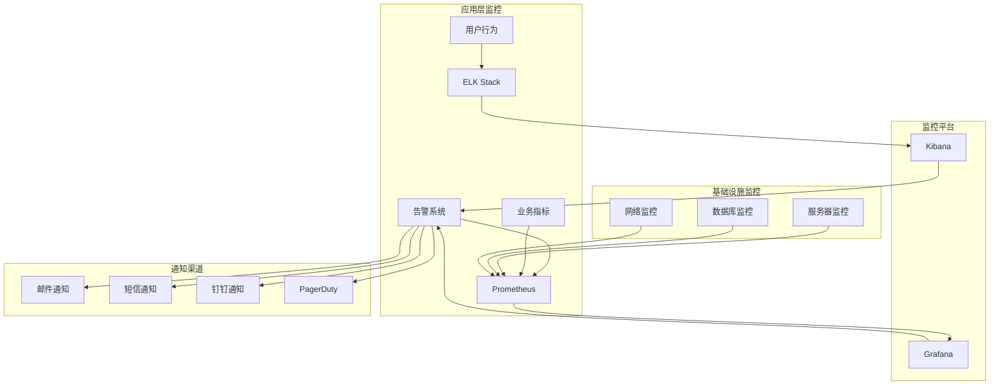
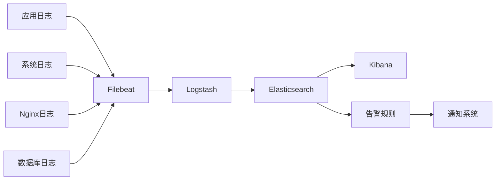

# 充值测试系统上线后监控和维护计划

## 概述

本文档详细描述了充值测试系统上线后的监控策略、维护计划、性能优化方案和持续改进措施。

## 监控体系

### 监控架构



### 监控指标体系

#### 1. 系统基础指标

**服务器监控**
```yaml
server_metrics:
  cpu:
    - usage_percent
    - load_average_1m
    - load_average_5m
    - load_average_15m
    
  memory:
    - usage_percent
    - available_bytes
    - swap_usage_percent
    
  disk:
    - usage_percent
    - io_utilization
    - read_write_ops
    
  network:
    - bandwidth_utilization
    - packet_loss_rate
    - connection_count
```

**数据库监控**
```yaml
database_metrics:
  performance:
    - query_response_time
    - slow_query_count
    - connection_pool_usage
    - lock_wait_time
    
  capacity:
    - storage_usage
    - table_size_growth
    - index_usage_efficiency
    
  availability:
    - uptime
    - replication_lag
    - backup_status
```

#### 2. 应用性能指标

**API性能监控**
```go
// monitoring/api_metrics.go
package monitoring

import (
    "github.com/prometheus/client_golang/prometheus"
    "github.com/prometheus/client_golang/prometheus/promauto"
)

var (
    // HTTP请求总数
    httpRequestsTotal = promauto.NewCounterVec(
        prometheus.CounterOpts{
            Name: "http_requests_total",
            Help: "Total number of HTTP requests",
        },
        []string{"method", "endpoint", "status"},
    )
    
    // HTTP请求响应时间
    httpRequestDuration = promauto.NewHistogramVec(
        prometheus.HistogramOpts{
            Name: "http_request_duration_seconds",
            Help: "Duration of HTTP requests",
            Buckets: prometheus.DefBuckets,
        },
        []string{"method", "endpoint"},
    )
    
    // 数据库查询时间
    dbQueryDuration = promauto.NewHistogramVec(
        prometheus.HistogramOpts{
            Name: "db_query_duration_seconds",
            Help: "Duration of database queries",
        },
        []string{"query_type", "table"},
    )
    
    // 业务指标
    rechargeOrdersTotal = promauto.NewCounterVec(
        prometheus.CounterOpts{
            Name: "recharge_orders_total",
            Help: "Total number of recharge orders",
        },
        []string{"merchant_id", "status"},
    )
    
    rechargeAmountTotal = promauto.NewCounterVec(
        prometheus.CounterOpts{
            Name: "recharge_amount_total",
            Help: "Total amount of recharge orders",
        },
        []string{"merchant_id"},
    )
)

// 记录HTTP请求指标
func RecordHTTPRequest(method, endpoint, status string, duration float64) {
    httpRequestsTotal.WithLabelValues(method, endpoint, status).Inc()
    httpRequestDuration.WithLabelValues(method, endpoint).Observe(duration)
}
```

#### 3. 业务关键指标

**充值业务指标**
```yaml
business_metrics:
  orders:
    - total_orders_per_hour
    - success_rate_percent
    - average_processing_time
    - failed_orders_count
    
  merchants:
    - active_merchants_count
    - new_merchants_per_day
    - merchant_success_rate
    
  accounts:
    - account_utilization_rate
    - account_matching_success_rate
    - daily_limit_usage_percent
    
  revenue:
    - total_amount_per_day
    - average_order_amount
    - revenue_growth_rate
```

### 告警规则配置

#### 1. 系统告警规则
```yaml
# prometheus/alert_rules.yml
groups:
  - name: system_alerts
    rules:
      - alert: HighCPUUsage
        expr: cpu_usage_percent > 80
        for: 5m
        labels:
          severity: warning
        annotations:
          summary: "CPU使用率过高"
          description: "服务器 {{ $labels.instance }} CPU使用率 {{ $value }}% 超过80%"
          
      - alert: HighMemoryUsage
        expr: memory_usage_percent > 85
        for: 5m
        labels:
          severity: warning
        annotations:
          summary: "内存使用率过高"
          description: "服务器 {{ $labels.instance }} 内存使用率 {{ $value }}% 超过85%"
          
      - alert: DiskSpaceLow
        expr: disk_usage_percent > 90
        for: 2m
        labels:
          severity: critical
        annotations:
          summary: "磁盘空间不足"
          description: "服务器 {{ $labels.instance }} 磁盘使用率 {{ $value }}% 超过90%"
```

#### 2. 应用告警规则
```yaml
  - name: application_alerts
    rules:
      - alert: HighErrorRate
        expr: rate(http_requests_total{status=~"5.."}[5m]) > 0.05
        for: 3m
        labels:
          severity: critical
        annotations:
          summary: "API错误率过高"
          description: "API错误率 {{ $value | humanizePercentage }} 超过5%"
          
      - alert: SlowAPIResponse
        expr: histogram_quantile(0.95, rate(http_request_duration_seconds_bucket[5m])) > 2
        for: 5m
        labels:
          severity: warning
        annotations:
          summary: "API响应时间过慢"
          description: "95%的API请求响应时间超过2秒"
          
      - alert: DatabaseConnectionHigh
        expr: db_connections_active / db_connections_max > 0.8
        for: 5m
        labels:
          severity: warning
        annotations:
          summary: "数据库连接数过高"
          description: "数据库连接使用率 {{ $value | humanizePercentage }} 超过80%"
```

#### 3. 业务告警规则
```yaml
  - name: business_alerts
    rules:
      - alert: LowOrderSuccessRate
        expr: recharge_order_success_rate < 0.95
        for: 10m
        labels:
          severity: warning
        annotations:
          summary: "充值订单成功率过低"
          description: "充值订单成功率 {{ $value | humanizePercentage }} 低于95%"
          
      - alert: AccountMatchingFailure
        expr: account_matching_success_rate < 0.9
        for: 5m
        labels:
          severity: critical
        annotations:
          summary: "账号匹配失败率过高"
          description: "账号匹配成功率 {{ $value | humanizePercentage }} 低于90%"
          
      - alert: UnusualOrderVolume
        expr: increase(recharge_orders_total[1h]) > 1000 or increase(recharge_orders_total[1h]) < 10
        for: 0m
        labels:
          severity: warning
        annotations:
          summary: "订单量异常"
          description: "过去1小时订单量 {{ $value }} 异常"
```

## 日志管理

### 日志架构



### 日志配置

#### 1. 应用日志配置
```go
// pkg/logger/structured_logger.go
package logger

import (
    "github.com/sirupsen/logrus"
    "os"
)

type StructuredLogger struct {
    *logrus.Logger
}

func NewStructuredLogger() *StructuredLogger {
    logger := logrus.New()
    
    // 设置日志格式
    logger.SetFormatter(&logrus.JSONFormatter{
        TimestampFormat: "2006-01-02 15:04:05",
        FieldMap: logrus.FieldMap{
            logrus.FieldKeyTime:  "timestamp",
            logrus.FieldKeyLevel: "level",
            logrus.FieldKeyMsg:   "message",
        },
    })
    
    // 设置日志级别
    if os.Getenv("APP_ENV") == "production" {
        logger.SetLevel(logrus.InfoLevel)
    } else {
        logger.SetLevel(logrus.DebugLevel)
    }
    
    return &StructuredLogger{logger}
}

func (l *StructuredLogger) LogRechargeOrder(orderNo string, action string, details map[string]interface{}) {
    l.WithFields(logrus.Fields{
        "module":   "recharge",
        "order_no": orderNo,
        "action":   action,
        "details":  details,
    }).Info("Recharge order event")
}

func (l *StructuredLogger) LogAPIRequest(method, path string, statusCode int, duration float64, userID string) {
    l.WithFields(logrus.Fields{
        "module":      "api",
        "method":      method,
        "path":        path,
        "status_code": statusCode,
        "duration_ms": duration * 1000,
        "user_id":     userID,
    }).Info("API request")
}
```

#### 2. 日志轮转配置
```bash
# /etc/logrotate.d/recharge-system
/opt/recharge-system/logs/*.log {
    daily
    missingok
    rotate 30
    compress
    delaycompress
    notifempty
    create 644 recharge recharge
    postrotate
        systemctl reload recharge-system
    endscript
}
```

#### 3. ELK配置
```yaml
# filebeat.yml
filebeat.inputs:
  - type: log
    enabled: true
    paths:
      - /opt/recharge-system/logs/*.log
    fields:
      service: recharge-system
      environment: production
    fields_under_root: true
    
output.logstash:
  hosts: ["logstash:5044"]
  
processors:
  - add_host_metadata:
      when.not.contains.tags: forwarded
```

```ruby
# logstash.conf
input {
  beats {
    port => 5044
  }
}

filter {
  if [service] == "recharge-system" {
    json {
      source => "message"
    }
    
    date {
      match => [ "timestamp", "yyyy-MM-dd HH:mm:ss" ]
    }
    
    if [module] == "api" {
      mutate {
        add_tag => [ "api_request" ]
      }
    }
    
    if [module] == "recharge" {
      mutate {
        add_tag => [ "business_event" ]
      }
    }
  }
}

output {
  elasticsearch {
    hosts => ["elasticsearch:9200"]
    index => "recharge-system-%{+YYYY.MM.dd}"
  }
}
```

## 性能监控

### 性能基准

#### 1. 响应时间基准
```yaml
response_time_benchmarks:
  api_endpoints:
    - endpoint: "/api/merchants"
      method: "GET"
      p50: 200ms
      p95: 500ms
      p99: 1000ms
      
    - endpoint: "/api/recharge/orders"
      method: "POST"
      p50: 300ms
      p95: 800ms
      p99: 1500ms
      
    - endpoint: "/api/export/orders"
      method: "POST"
      p50: 1000ms
      p95: 3000ms
      p99: 5000ms
```

#### 2. 吞吐量基准
```yaml
throughput_benchmarks:
  concurrent_users: 100
  requests_per_second: 500
  peak_requests_per_second: 1000
  
  business_metrics:
    orders_per_hour: 1000
    peak_orders_per_hour: 2000
    concurrent_recharge_sessions: 50
```

### 性能监控脚本

#### 1. 自动化性能测试
```bash
#!/bin/bash
# scripts/performance-monitor.sh

echo "开始性能监控..."

# 1. API响应时间测试
echo "测试API响应时间..."
curl -w "@curl-format.txt" -o /dev/null -s "http://localhost:8080/api/merchants"

# 2. 数据库性能测试
echo "测试数据库性能..."
mysql -e "
    SELECT 
        ROUND(AVG(query_time), 4) as avg_query_time,
        COUNT(*) as query_count
    FROM mysql.slow_log 
    WHERE start_time >= DATE_SUB(NOW(), INTERVAL 1 HOUR);
"

# 3. 系统资源使用
echo "检查系统资源..."
top -bn1 | grep "Cpu(s)" | awk '{print "CPU: " $2}'
free -h | grep "Mem:" | awk '{print "Memory: " $3 "/" $2}'
df -h | grep "/opt" | awk '{print "Disk: " $5}'

# 4. 业务指标检查
echo "检查业务指标..."
curl -s "http://localhost:8080/metrics" | grep "recharge_orders_total"

echo "性能监控完成"
```

#### 2. 性能报告生成
```go
// monitoring/performance_report.go
package monitoring

import (
    "fmt"
    "time"
)

type PerformanceReport struct {
    Timestamp    time.Time
    APIMetrics   APIMetrics
    DBMetrics    DatabaseMetrics
    SystemMetrics SystemMetrics
    BusinessMetrics BusinessMetrics
}

type APIMetrics struct {
    AverageResponseTime float64
    P95ResponseTime     float64
    ErrorRate          float64
    RequestsPerSecond  float64
}

func GeneratePerformanceReport() *PerformanceReport {
    report := &PerformanceReport{
        Timestamp: time.Now(),
    }
    
    // 收集API指标
    report.APIMetrics = collectAPIMetrics()
    
    // 收集数据库指标
    report.DBMetrics = collectDatabaseMetrics()
    
    // 收集系统指标
    report.SystemMetrics = collectSystemMetrics()
    
    // 收集业务指标
    report.BusinessMetrics = collectBusinessMetrics()
    
    return report
}

func (r *PerformanceReport) GenerateHTML() string {
    return fmt.Sprintf(`
    <html>
    <head><title>性能报告 - %s</title></head>
    <body>
        <h1>系统性能报告</h1>
        <p>生成时间: %s</p>
        
        <h2>API性能</h2>
        <ul>
            <li>平均响应时间: %.2fms</li>
            <li>95%%响应时间: %.2fms</li>
            <li>错误率: %.2f%%</li>
            <li>每秒请求数: %.2f</li>
        </ul>
        
        <h2>数据库性能</h2>
        <ul>
            <li>平均查询时间: %.2fms</li>
            <li>慢查询数量: %d</li>
            <li>连接池使用率: %.2f%%</li>
        </ul>
        
        <h2>系统资源</h2>
        <ul>
            <li>CPU使用率: %.2f%%</li>
            <li>内存使用率: %.2f%%</li>
            <li>磁盘使用率: %.2f%%</li>
        </ul>
    </body>
    </html>
    `, r.Timestamp.Format("2006-01-02 15:04:05"),
       r.Timestamp.Format("2006-01-02 15:04:05"),
       r.APIMetrics.AverageResponseTime,
       r.APIMetrics.P95ResponseTime,
       r.APIMetrics.ErrorRate*100,
       r.APIMetrics.RequestsPerSecond,
       r.DBMetrics.AverageQueryTime,
       r.DBMetrics.SlowQueryCount,
       r.DBMetrics.ConnectionPoolUsage*100,
       r.SystemMetrics.CPUUsage*100,
       r.SystemMetrics.MemoryUsage*100,
       r.SystemMetrics.DiskUsage*100)
}
```

## 维护计划

### 日常维护任务

#### 1. 每日维护清单
```bash
#!/bin/bash
# scripts/daily-maintenance.sh

echo "执行每日维护任务..."

# 1. 系统健康检查
echo "1. 系统健康检查"
./scripts/health-check.sh

# 2. 日志分析
echo "2. 分析错误日志"
grep -i error /opt/recharge-system/logs/app.log | tail -50

# 3. 数据库维护
echo "3. 数据库维护"
mysql -e "
    -- 检查表状态
    SHOW TABLE STATUS;
    
    -- 检查慢查询
    SELECT * FROM mysql.slow_log 
    WHERE start_time >= DATE_SUB(NOW(), INTERVAL 24 HOUR)
    ORDER BY query_time DESC LIMIT 10;
"

# 4. 备份验证
echo "4. 验证备份"
ls -la /opt/backups/recharge-system/ | tail -5

# 5. 性能指标检查
echo "5. 性能指标检查"
curl -s http://localhost:8080/metrics | grep -E "(cpu|memory|response_time)"

# 6. 磁盘空间检查
echo "6. 磁盘空间检查"
df -h | grep -E "(/$|/opt|/var)"

echo "每日维护任务完成"
```

#### 2. 每周维护清单
```bash
#!/bin/bash
# scripts/weekly-maintenance.sh

echo "执行每周维护任务..."

# 1. 数据库优化
echo "1. 数据库优化"
mysql -e "
    -- 优化表
    OPTIMIZE TABLE merchants, recharge_orders, merchant_accounts;
    
    -- 分析表
    ANALYZE TABLE merchants, recharge_orders, merchant_accounts;
    
    -- 检查索引使用情况
    SELECT 
        table_name,
        index_name,
        cardinality,
        sub_part,
        packed,
        nullable,
        index_type
    FROM information_schema.statistics 
    WHERE table_schema = 'recharge_system'
    ORDER BY table_name, seq_in_index;
"

# 2. 清理临时文件
echo "2. 清理临时文件"
find /tmp -name "recharge_*" -mtime +7 -delete
find /opt/recharge-system/uploads -name "*.tmp" -mtime +7 -delete

# 3. 日志归档
echo "3. 日志归档"
tar -czf /opt/backups/logs/app_logs_$(date +%Y%m%d).tar.gz /opt/recharge-system/logs/*.log.1

# 4. 安全扫描
echo "4. 安全扫描"
./scripts/security-scan.sh

# 5. 性能报告生成
echo "5. 生成性能报告"
./scripts/generate-performance-report.sh

echo "每周维护任务完成"
```

#### 3. 每月维护清单
```bash
#!/bin/bash
# scripts/monthly-maintenance.sh

echo "执行每月维护任务..."

# 1. 系统更新检查
echo "1. 检查系统更新"
apt list --upgradable

# 2. 容量规划分析
echo "2. 容量规划分析"
./scripts/capacity-planning-analysis.sh

# 3. 备份策略验证
echo "3. 验证备份策略"
./scripts/backup-verification.sh

# 4. 灾难恢复演练
echo "4. 灾难恢复演练"
./scripts/disaster-recovery-drill.sh

# 5. 用户满意度调查
echo "5. 用户满意度调查"
./scripts/user-satisfaction-survey.sh

# 6. 系统架构评估
echo "6. 系统架构评估"
./scripts/architecture-assessment.sh

echo "每月维护任务完成"
```

### 预防性维护

#### 1. 数据库维护
```sql
-- 数据库维护脚本
-- scripts/db-maintenance.sql

-- 1. 清理过期数据
DELETE FROM order_logs 
WHERE created_at < DATE_SUB(NOW(), INTERVAL 90 DAY);

DELETE FROM notification_logs 
WHERE created_at < DATE_SUB(NOW(), INTERVAL 30 DAY);

-- 2. 重建统计信息
ANALYZE TABLE merchants, recharge_orders, merchant_accounts;

-- 3. 检查表碎片
SELECT 
    table_name,
    ROUND(((data_length + index_length) / 1024 / 1024), 2) AS 'Size (MB)',
    ROUND((data_free / 1024 / 1024), 2) AS 'Free Space (MB)',
    ROUND((data_free / (data_length + index_length)) * 100, 2) AS 'Fragmentation %'
FROM information_schema.tables 
WHERE table_schema = 'recharge_system'
AND data_free > 0;

-- 4. 优化碎片化严重的表
-- (根据上面查询结果手动执行)
-- OPTIMIZE TABLE table_name;
```

#### 2. 缓存维护
```bash
#!/bin/bash
# scripts/cache-maintenance.sh

echo "执行缓存维护..."

# 1. Redis内存分析
echo "1. Redis内存分析"
redis-cli info memory

# 2. 清理过期缓存
echo "2. 清理过期缓存"
redis-cli --scan --pattern "temp:*" | xargs redis-cli del

# 3. 缓存命中率分析
echo "3. 缓存命中率分析"
redis-cli info stats | grep -E "(keyspace_hits|keyspace_misses)"

# 4. 内存优化
echo "4. 内存优化"
redis-cli config set maxmemory-policy allkeys-lru

echo "缓存维护完成"
```

## 持续改进

### 性能优化

#### 1. 数据库优化
```sql
-- 性能优化建议

-- 1. 添加复合索引
CREATE INDEX idx_orders_merchant_status_date 
ON recharge_orders(merchant_id, status, created_at);

CREATE INDEX idx_orders_date_status 
ON recharge_orders(DATE(created_at), status);

-- 2. 分区表设计（针对大数据量）
ALTER TABLE recharge_orders 
PARTITION BY RANGE (YEAR(created_at)) (
    PARTITION p2024 VALUES LESS THAN (2025),
    PARTITION p2025 VALUES LESS THAN (2026),
    PARTITION p_future VALUES LESS THAN MAXVALUE
);

-- 3. 查询优化
-- 使用覆盖索引
CREATE INDEX idx_orders_export 
ON recharge_orders(created_at, merchant_id, status, amount, payer_name);
```

#### 2. 应用优化
```go
// optimization/query_optimizer.go
package optimization

import (
    "context"
    "time"
    "github.com/go-redis/redis/v8"
    "gorm.io/gorm"
)

type QueryOptimizer struct {
    db    *gorm.DB
    redis *redis.Client
}

// 优化商户查询
func (q *QueryOptimizer) GetMerchantWithCache(ctx context.Context, id uint) (*Merchant, error) {
    cacheKey := fmt.Sprintf("merchant:%d", id)
    
    // 先从缓存获取
    cached, err := q.redis.Get(ctx, cacheKey).Result()
    if err == nil {
        var merchant Merchant
        json.Unmarshal([]byte(cached), &merchant)
        return &merchant, nil
    }
    
    // 缓存未命中，从数据库查询
    var merchant Merchant
    err = q.db.First(&merchant, id).Error
    if err != nil {
        return nil, err
    }
    
    // 写入缓存
    data, _ := json.Marshal(merchant)
    q.redis.Set(ctx, cacheKey, data, 10*time.Minute)
    
    return &merchant, nil
}

// 批量查询优化
func (q *QueryOptimizer) GetOrdersWithPagination(ctx context.Context, req *ListOrdersRequest) (*ListOrdersResponse, error) {
    var orders []RechargeOrder
    var total int64
    
    query := q.db.Model(&RechargeOrder{})
    
    // 添加查询条件
    if req.MerchantID > 0 {
        query = query.Where("merchant_id = ?", req.MerchantID)
    }
    if req.Status != "" {
        query = query.Where("status = ?", req.Status)
    }
    if !req.StartDate.IsZero() {
        query = query.Where("created_at >= ?", req.StartDate)
    }
    if !req.EndDate.IsZero() {
        query = query.Where("created_at <= ?", req.EndDate)
    }
    
    // 获取总数（使用子查询优化）
    err := query.Count(&total).Error
    if err != nil {
        return nil, err
    }
    
    // 分页查询（预加载关联数据）
    err = query.Preload("Merchant").Preload("ReceiveAccount").
        Offset((req.Page - 1) * req.Limit).
        Limit(req.Limit).
        Order("created_at DESC").
        Find(&orders).Error
    
    if err != nil {
        return nil, err
    }
    
    return &ListOrdersResponse{
        Orders: orders,
        Pagination: Pagination{
            Page:  req.Page,
            Limit: req.Limit,
            Total: total,
            Pages: (total + int64(req.Limit) - 1) / int64(req.Limit),
        },
    }, nil
}
```

### 监控改进

#### 1. 自定义监控指标
```go
// monitoring/custom_metrics.go
package monitoring

import (
    "github.com/prometheus/client_golang/prometheus"
    "github.com/prometheus/client_golang/prometheus/promauto"
)

var (
    // 业务流程监控
    rechargeFlowDuration = promauto.NewHistogramVec(
        prometheus.HistogramOpts{
            Name: "recharge_flow_duration_seconds",
            Help: "Duration of complete recharge flow",
            Buckets: []float64{1, 5, 10, 30, 60, 300, 600},
        },
        []string{"merchant_id", "payment_type"},
    )
    
    // 账号匹配效率
    accountMatchingDuration = promauto.NewHistogramVec(
        prometheus.HistogramOpts{
            Name: "account_matching_duration_seconds",
            Help: "Duration of account matching process",
        },
        []string{"merchant_id", "payment_type"},
    )
    
    // 用户体验指标
    userSatisfactionScore = promauto.NewGaugeVec(
        prometheus.GaugeOpts{
            Name: "user_satisfaction_score",
            Help: "User satisfaction score (1-5)",
        },
        []string{"merchant_id"},
    )
)

// 记录充值流程时长
func RecordRechargeFlowDuration(merchantID string, paymentType string, duration float64) {
    rechargeFlowDuration.WithLabelValues(merchantID, paymentType).Observe(duration)
}
```

#### 2. 智能告警
```go
// monitoring/intelligent_alerting.go
package monitoring

import (
    "context"
    "time"
    "math"
)

type IntelligentAlerting struct {
    metrics MetricsCollector
    ml      MachineLearningModel
}

// 异常检测
func (ia *IntelligentAlerting) DetectAnomalies(ctx context.Context) []Anomaly {
    var anomalies []Anomaly
    
    // 获取当前指标
    currentMetrics := ia.metrics.GetCurrentMetrics()
    
    // 获取历史基线
    baseline := ia.metrics.GetHistoricalBaseline(7 * 24 * time.Hour)
    
    // 检测响应时间异常
    if currentMetrics.ResponseTime > baseline.ResponseTime*1.5 {
        anomalies = append(anomalies, Anomaly{
            Type:        "response_time",
            Severity:    "warning",
            Description: fmt.Sprintf("响应时间异常: 当前%.2fs, 基线%.2fs", 
                        currentMetrics.ResponseTime, baseline.ResponseTime),
            Confidence:  0.8,
        })
    }
    
    // 检测订单量异常
    expectedOrderCount := ia.ml.PredictOrderCount(time.Now())
    actualOrderCount := currentMetrics.OrderCount
    
    deviation := math.Abs(float64(actualOrderCount-expectedOrderCount)) / float64(expectedOrderCount)
    if deviation > 0.3 {
        anomalies = append(anomalies, Anomaly{
            Type:        "order_volume",
            Severity:    "warning",
            Description: fmt.Sprintf("订单量异常: 预期%d, 实际%d", 
                        expectedOrderCount, actualOrderCount),
            Confidence:  0.9,
        })
    }
    
    return anomalies
}
```

### 用户体验改进

#### 1. 用户反馈收集
```go
// feedback/collector.go
package feedback

type FeedbackCollector struct {
    db *gorm.DB
}

type UserFeedback struct {
    ID          uint      `json:"id"`
    UserID      string    `json:"user_id"`
    MerchantID  uint      `json:"merchant_id"`
    OrderNo     string    `json:"order_no"`
    Rating      int       `json:"rating"`      // 1-5分
    Category    string    `json:"category"`    // 功能分类
    Content     string    `json:"content"`     // 反馈内容
    Status      string    `json:"status"`      // 处理状态
    CreatedAt   time.Time `json:"created_at"`
}

func (fc *FeedbackCollector) CollectFeedback(feedback *UserFeedback) error {
    // 保存反馈
    err := fc.db.Create(feedback).Error
    if err != nil {
        return err
    }
    
    // 更新用户满意度指标
    userSatisfactionScore.WithLabelValues(
        fmt.Sprintf("%d", feedback.MerchantID),
    ).Set(float64(feedback.Rating))
    
    // 低分反馈自动创建工单
    if feedback.Rating <= 2 {
        fc.createSupportTicket(feedback)
    }
    
    return nil
}

func (fc *FeedbackCollector) AnalyzeFeedback() *FeedbackAnalysis {
    var analysis FeedbackAnalysis
    
    // 计算平均满意度
    fc.db.Model(&UserFeedback{}).
        Select("AVG(rating) as avg_rating").
        Where("created_at >= ?", time.Now().AddDate(0, 0, -30)).
        Scan(&analysis.AverageRating)
    
    // 分析问题分类
    fc.db.Model(&UserFeedback{}).
        Select("category, COUNT(*) as count").
        Where("rating <= 2").
        Where("created_at >= ?", time.Now().AddDate(0, 0, -30)).
        Group("category").
        Scan(&analysis.IssueCategories)
    
    return &analysis
}
```

#### 2. A/B测试框架
```go
// testing/ab_testing.go
package testing

type ABTestManager struct {
    redis *redis.Client
}

type ABTest struct {
    Name        string    `json:"name"`
    Description string    `json:"description"`
    StartTime   time.Time `json:"start_time"`
    EndTime     time.Time `json:"end_time"`
    Variants    []Variant `json:"variants"`
    Status      string    `json:"status"`
}

type Variant struct {
    Name        string  `json:"name"`
    Traffic     float64 `json:"traffic"`     // 流量分配比例
    Config      map[string]interface{} `json:"config"`
    Conversions int     `json:"conversions"`
    Visitors    int     `json:"visitors"`
}

func (ab *ABTestManager) GetVariant(testName, userID string) *Variant {
    // 获取测试配置
    test := ab.getTest(testName)
    if test == nil || test.Status != "active" {
        return nil
    }
    
    // 基于用户ID的一致性哈希分配
    hash := ab.hashUser(userID)
    
    var cumulative float64
    for _, variant := range test.Variants {
        cumulative += variant.Traffic
        if hash < cumulative {
            return &variant
        }
    }
    
    return &test.Variants[0] // 默认返回第一个变体
}

func (ab *ABTestManager) RecordConversion(testName, userID string) {
    variant := ab.GetVariant(testName, userID)
    if variant != nil {
        // 记录转化
        key := fmt.Sprintf("ab_test:%s:%s:conversions", testName, variant.Name)
        ab.redis.Incr(context.Background(), key)
    }
}
```

## 容量规划

### 容量监控

#### 1. 资源使用趋势分析
```go
// capacity/analyzer.go
package capacity

type CapacityAnalyzer struct {
    prometheus PrometheusClient
}

type CapacityForecast struct {
    Resource     string    `json:"resource"`
    CurrentUsage float64   `json:"current_usage"`
    Trend        float64   `json:"trend"`          // 增长趋势
    Forecast30d  float64   `json:"forecast_30d"`   // 30天预测
    Forecast90d  float64   `json:"forecast_90d"`   // 90天预测
    Threshold    float64   `json:"threshold"`      // 告警阈值
    Action       string    `json:"action"`         // 建议操作
}

func (ca *CapacityAnalyzer) AnalyzeCapacity() []CapacityForecast {
    var forecasts []CapacityForecast
    
    // CPU容量分析
    cpuUsage := ca.prometheus.GetAverageMetric("cpu_usage_percent", 7*24*time.Hour)
    cpuTrend := ca.calculateTrend("cpu_usage_percent", 30*24*time.Hour)
    
    forecasts = append(forecasts, CapacityForecast{
        Resource:     "CPU",
        CurrentUsage: cpuUsage,
        Trend:        cpuTrend,
        Forecast30d:  cpuUsage + cpuTrend*30,
        Forecast90d:  cpuUsage + cpuTrend*90,
        Threshold:    80.0,
        Action:       ca.getRecommendedAction("CPU", cpuUsage+cpuTrend*30),
    })
    
    // 内存容量分析
    memUsage := ca.prometheus.GetAverageMetric("memory_usage_percent", 7*24*time.Hour)
    memTrend := ca.calculateTrend("memory_usage_percent", 30*24*time.Hour)
    
    forecasts = append(forecasts, CapacityForecast{
        Resource:     "Memory",
        CurrentUsage: memUsage,
        Trend:        memTrend,
        Forecast30d:  memUsage + memTrend*30,
        Forecast90d:  memUsage + memTrend*90,
        Threshold:    85.0,
        Action:       ca.getRecommendedAction("Memory", memUsage+memTrend*30),
    })
    
    // 数据库容量分析
    dbSize := ca.prometheus.GetCurrentMetric("database_size_gb")
    dbTrend := ca.calculateTrend("database_size_gb", 30*24*time.Hour)
    
    forecasts = append(forecasts, CapacityForecast{
        Resource:     "Database",
        CurrentUsage: dbSize,
        Trend:        dbTrend,
        Forecast30d:  dbSize + dbTrend*30,
        Forecast90d:  dbSize + dbTrend*90,
        Threshold:    100.0, // GB
        Action:       ca.getRecommendedAction("Database", dbSize+dbTrend*30),
    })
    
    return forecasts
}

func (ca *CapacityAnalyzer) getRecommendedAction(resource string, forecastValue float64) string {
    switch resource {
    case "CPU":
        if forecastValue > 80 {
            return "建议增加CPU资源或优化应用性能"
        }
    case "Memory":
        if forecastValue > 85 {
            return "建议增加内存或优化内存使用"
        }
    case "Database":
        if forecastValue > 100 {
            return "建议扩展数据库存储或清理历史数据"
        }
    }
    return "当前容量充足"
}
```

#### 2. 自动扩容建议
```go
// capacity/auto_scaling.go
package capacity

type AutoScalingRecommendation struct {
    Service     string  `json:"service"`
    CurrentSize int     `json:"current_size"`
    RecommendedSize int `json:"recommended_size"`
    Reason      string  `json:"reason"`
    Confidence  float64 `json:"confidence"`
    EstimatedCost float64 `json:"estimated_cost"`
}

func (ca *CapacityAnalyzer) GetScalingRecommendations() []AutoScalingRecommendation {
    var recommendations []AutoScalingRecommendation
    
    // 分析API服务扩容需求
    avgResponseTime := ca.prometheus.GetAverageMetric("http_request_duration_seconds", 24*time.Hour)
    requestRate := ca.prometheus.GetAverageMetric("http_requests_per_second", 24*time.Hour)
    
    if avgResponseTime > 1.0 && requestRate > 100 {
        recommendations = append(recommendations, AutoScalingRecommendation{
            Service:         "api-server",
            CurrentSize:     2,
            RecommendedSize: 4,
            Reason:          "响应时间过长且请求量较高",
            Confidence:      0.8,
            EstimatedCost:   200.0, // 每月成本
        })
    }
    
    // 分析数据库扩容需求
    dbConnections := ca.prometheus.GetAverageMetric("db_connections_active", 24*time.Hour)
    dbMaxConnections := ca.prometheus.GetCurrentMetric("db_connections_max")
    
    if dbConnections/dbMaxConnections > 0.8 {
        recommendations = append(recommendations, AutoScalingRecommendation{
            Service:         "database",
            CurrentSize:     1,
            RecommendedSize: 2,
            Reason:          "数据库连接数接近上限",
            Confidence:      0.9,
            EstimatedCost:   500.0,
        })
    }
    
    return recommendations
}
```

## 总结

本监控和维护计划涵盖了系统上线后的全方位管理：

### 监控体系
- **多层次监控**: 系统、应用、业务三个层面
- **智能告警**: 基于机器学习的异常检测
- **实时仪表板**: 直观的监控界面

### 维护策略
- **预防性维护**: 定期的系统优化和清理
- **自动化运维**: 减少人工干预，提高效率
- **容量规划**: 前瞻性的资源规划

### 持续改进
- **性能优化**: 基于监控数据的持续优化
- **用户体验**: 收集反馈，持续改进
- **技术演进**: 跟踪新技术，适时升级

通过执行这个全面的监控和维护计划，可以确保充值测试系统的稳定运行和持续改进。

---

**文档版本**: v1.0  
**更新日期**: 2024-08-12  
**维护团队**: 系统运维团队