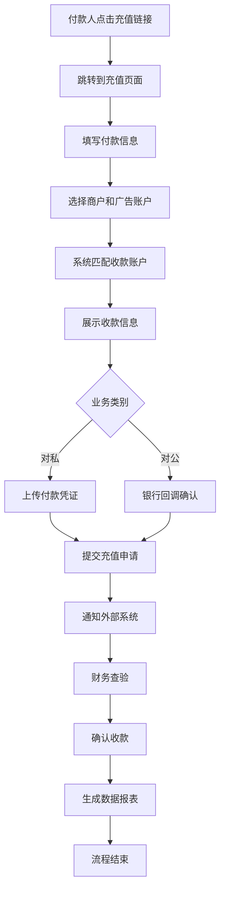

# 充值系统重设计方案

## 业务流程分析

### 1. 核心业务流程

### 2. 核心数据实体关系

#### 商户 (Merchant)
- 商户ID (自动生成)
- 商户名称 (必填)
- 充值链接 (自动生成)
- 状态 (待审核/启用/禁用)
- 创建时间
- 联系信息

#### 付款账户 (PaymentAccount)
- 付款账户名称
- 付款账号
- 账户机构 (银行卡/支付宝/微信/其他)
- 银行名称 (当选择银行卡时)
- 关联商户
- 状态 (启用/禁用)

#### 收款账户 (ReceiveAccount)
- 收款账户名称
- 收款账号
- 账户机构
- 银行名称
- 日限额/单笔限额
- 今日收款统计
- 状态 (启用/禁用)

#### 广告账户 (AdAccount)
- 广告账户ID
- 广告账户名称
- 关联商户

#### 充值订单 (RechargeOrder)
- 订单号 (自动生成)
- 银行凭证号
- 交易金额
- 商户信息
- 付款账户信息
- 收款账户信息
- 业务类别 (对公/对私)
- 状态 (交易成功/交易失败/待审核)
- 时间记录 (创建/成功/审核)

#### 轮询规则 (PollingRule)
- 规则名称
- 关联商户
- 匹配条件
- 收款账户分配策略

### 3. 关键业务规则

#### 账户匹配规则
1. 付款人填写信息必须在系统内存在
2. 商户信息必须在系统内存在
3. 根据轮询规则自动分配收款账户
4. 检查收款账户限额和状态

#### 安全验证规则
1. 付款账户白名单验证
2. 商户状态验证
3. 收款账户可用性验证
4. 金额限制验证

### 4. 表格优化需求

#### 通用表格功能
- 表格视图/卡片视图切换
- 左右滚动时固定列
- 响应式设计
- 排序和筛选
- 批量操作

#### 固定列规则
- 序号列：始终固定在左侧
- 操作列：始终固定在右侧
- 关键标识列：根据业务需要固定

### 5. 系统集成

#### 外部系统通知
- 账户币系统充值通知API
- 银行回调接口处理
- 财务系统数据同步

#### 报表导出
- 订单明细报表
- 财务对账报表
- 商户统计报表
- 收款账户分析报表

## 技术架构

### 前端组件设计
1. 通用表格组件 (支持视图切换)
2. 模态框组件 (统一样式)
3. 表单验证组件
4. 文件上传组件
5. 状态展示组件

### 后端API设计
1. 充值流程API
2. 商户管理API
3. 账户管理API
4. 财务审核API
5. 报表导出API

### 数据库设计
1. 标准化数据表结构
2. 索引优化策略
3. 数据关联约束
4. 历史数据处理

## 实施计划

### 第一阶段：基础架构
1. 数据库表结构设计
2. 通用组件开发
3. 基础API接口

### 第二阶段：核心功能
1. 充值页面开发
2. 商户管理功能
3. 账户管理功能

### 第三阶段：高级功能
1. 财务审核系统
2. 报表系统
3. 系统集成

### 第四阶段：优化完善
1. 性能优化
2. 安全加固
3. 用户体验优化