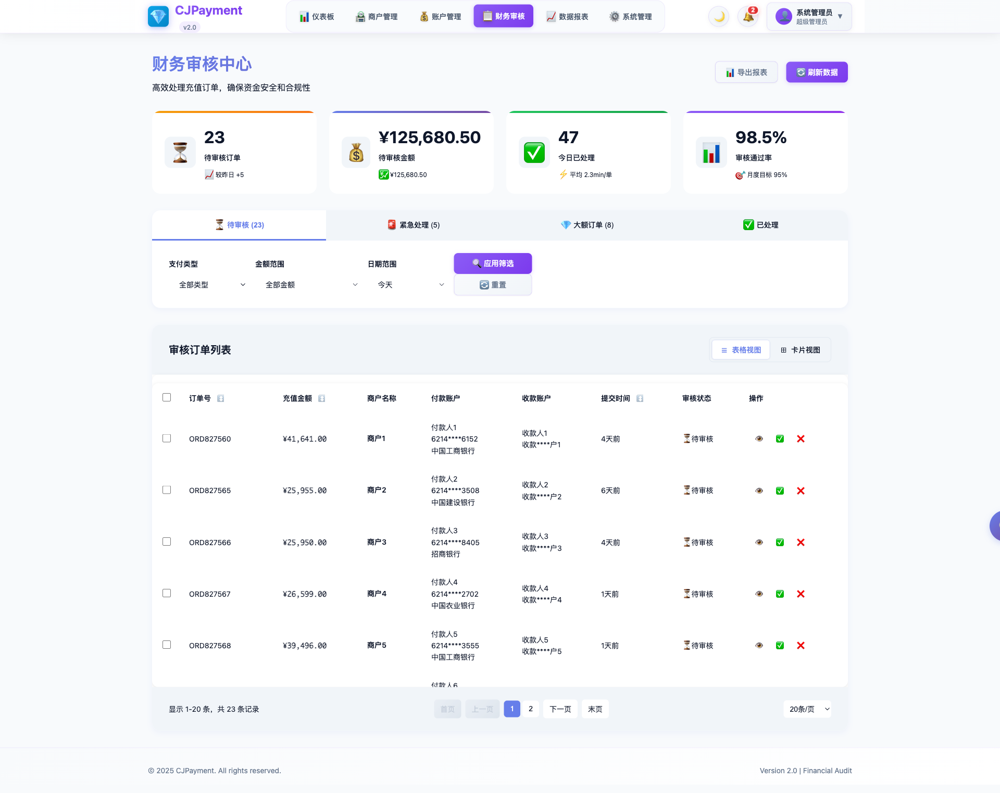

# 财务审核页面修复验证报告

## 测试概览

- **测试时间**: 2025-08-22T16:23:47.148Z
- **整体结果**: ❌ 失败
- **测试步骤**: 6 个
- **失败步骤**: 1 个
- **错误数量**: 0 个

## 修复验证要点

### 1. 页面访问测试
✅ 直接访问 http://127.0.0.1:8091/audit 页面

### 2. 重定向检查
✅ 确认页面不重定向到登录页面

### 3. 页面内容验证
✅ 页面内容正常显示

### 4. 演示模式日志
❌ 控制台显示演示模式相关日志

### 5. 网络请求分析
✅ 无401认证错误

### 6. 页面交互功能
✅ 页面交互功能正常

## 详细测试结果


### 步骤1: 访问财务审核页面

**结果**: ✅ 成功

**详细信息**:
```json
{
  "targetUrl": "http://127.0.0.1:8091/audit",
  "finalUrl": "http://127.0.0.1:8091/audit",
  "loadTime": "1637ms",
  "redirected": false
}
```


### 步骤2: 检查页面重定向状态

**结果**: ✅ 成功

**详细信息**:
```json
{
  "isOnLoginPage": false,
  "isOnAuditPage": true,
  "currentUrl": "http://127.0.0.1:8091/audit",
  "redirectToLoginFixed": true
}
```


### 步骤3: 检查页面内容

**结果**: ✅ 成功

**详细信息**:
```json
{
  "pageTitle": "财务审核 - CJPayment 企业内部支付管理系统",
  "contentLength": 47927,
  "hasMainContent": true,
  "errorElementsCount": 0
}
```


### 步骤4: 检查控制台日志

**结果**: ❌ 失败

**详细信息**:
```json
{
  "totalLogs": 15,
  "demoModeLogsCount": 0,
  "authLogsCount": 0,
  "demoModeLogs": [],
  "authLogs": []
}
```


### 步骤5: 分析网络请求

**结果**: ✅ 成功

**详细信息**:
```json
{
  "totalRequests": 16,
  "totalResponses": 16,
  "loginRequestsCount": 0,
  "apiRequestsCount": 0,
  "unauthorizedCount": 0,
  "unauthorizedUrls": []
}
```


### 步骤6: 测试页面交互功能

**结果**: ✅ 成功

**详细信息**:
```json
{
  "buttonsCount": 104,
  "linksCount": 11,
  "inputsCount": 25,
  "interactionPossible": true
}
```


## 控制台日志分析

**总日志数量**: 15

**演示模式相关日志**:
无

**认证相关日志**:
无

## 网络活动分析

**请求总数**: 16
**响应总数**: 16
**401错误数**: 0

## 截图记录

- 
- 
- 

## 修复效果评估


### ❌ 修复未完全生效

存在以下问题需要进一步处理：


失败的步骤：
- 步骤4: 检查控制台日志


---
*报告生成时间: 2025/8/23 00:24:01*
